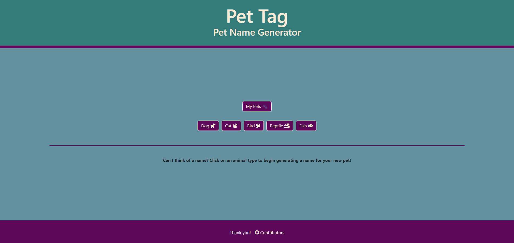
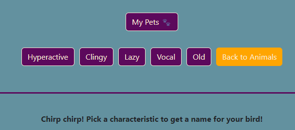
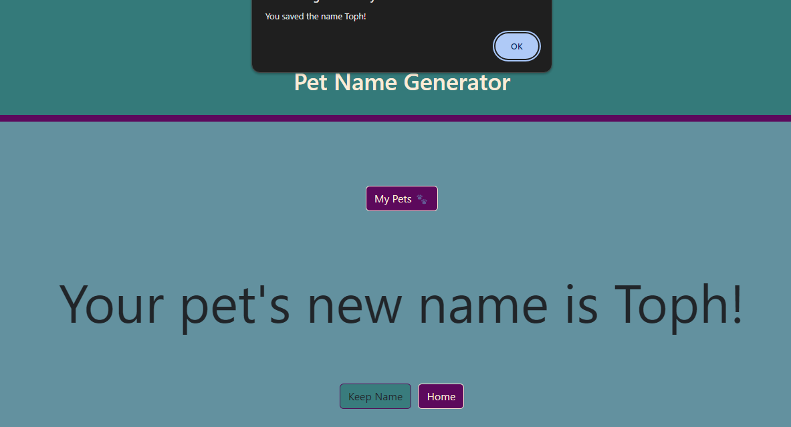
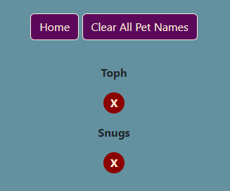
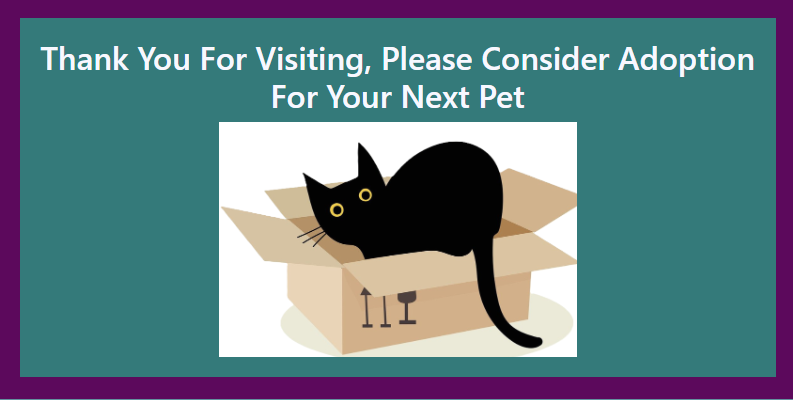

# Pet Name Generator
Bootcamp Group Project 1
(https://achensen.github.io/Project-1/)

## User Story
- *AS A new animal caregiver*
- *I WANT to be able to have animal names generated for me*
- *SO THAT I can find the perfect name for my pet*

## Description
The "Pet Name Generator" is a fun, button-based web application that helps users generate unique names for their pets. The process is interactive: users click on an animal's name, which generates additional buttons representing various characteristics of the animal. The application then uses the selected characteristics to create a personalized and unique pet name.
## Features
- Choose an animal from a list of buttons (e.g., `Dog`, `Cat`, `Bird`).
- After selecting an animal, a set of characteristic buttons appears (e.g., `Hyperactive`, `Clingy`, `Lazy`...).
- The final pet name is generated based on the selected characteristics.

## How It Works
1. Animal Selection: The user starts by clicking on an animal button (e.g., `Dog`).
2. Select Characteristics: After choosing an animal, new buttons representing different characteristics (`Hyperactive`, `Clingy`, `Lazy`...) appear.
3. Name Generation: The app generates a custom pet name based on the selected animal and its characteristics.

## Storage Options
- You can access your saved pet names by selecting the `My Pets` Button
- It is also possible to discard names that were saved by selecting the `x` underneath each name
- You can choose the button `Clear All Pet Names` to remove all saved pet names from storage and start over

## Technologies Used
- HTML for creating the structure of the web page.
- CSS for styling buttons and layout.
- JavaScript for handling button clicks and generating pet names dynamically.
## Other Features
- Select `Contributors` at the bottom of the main page for links to each group members GitHUB profile.
- The `Thank You` button at the bottom of the contributors pages will provide a message about pet adoption.

## Future Modification
You could improve this application in the future by:
- Modifying or adding more animals 
- Modifying or adding characteristics for each animal.
- Divide the current array used to generate a name into seperate arrays per animal and characteristic.
- Including information for pet adoption centers.
## CatBox Image
- by BiancaVanDijk via Pixabay
    https://pixabay.com/illustrations/box-cat-pet-animal-black-cat-8702500/
